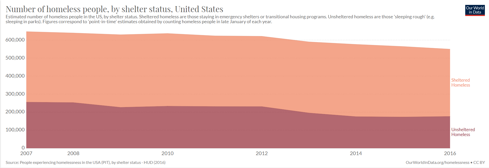
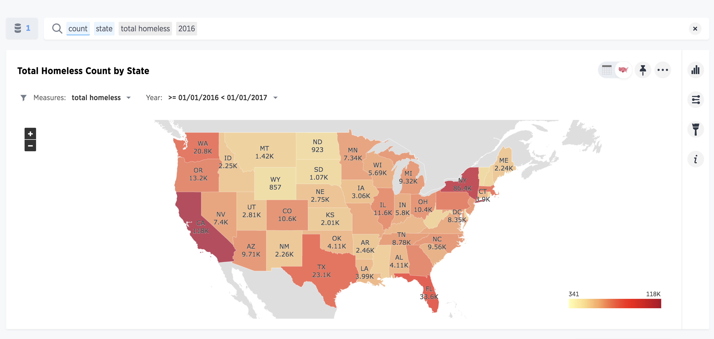

# P1: Project Proposal

 **Project Code name :** Team#1

 **Working Title :** Homelessness in the US

 **Team Member names :** Destiny Broughton (brougd@uw.edu), Mehul Goel (mehulg8@uw.edu), Salma Mohamed(salmam6@uw.edu)    

 **Affiliation Info-201 :**     
Technical Foundations of Informatics   
The Information School  
University of Washington  
Autumn 2019

**Problem situation :**
 The stakeholders in our problem are society and more directly the economy (indirect stakeholder) and those who are currently homeless (direct stakeholder). The setting of our problem is cities and societies across the United States, plagued with homelessness. Values and tensions in play when addressing this problem include lack of affordable low-income housing, unemployment, unexpected changes in life (bankruptcy, loss of job). Policy and ethical elements exist within this problem in that the government plays a role in regulating institutions and creating policy that may be alleviating or perpetuating the problem of homelessness. On an ethical side, we see that many veterans are currently homeless and the government isn’t providing resources  to help them, as well as the apathetic nature of society towards the homeless population.

**What is the problem?** The problem is that homelessness is increasing exponentially due to unemployment, lack of low-income housing, substance abuse problems, healthcare, etc. The effects of homelessness are devastating in that many homeless people are without basic necessities, including food security, and lack the resources to achieve upward mobility (i.e. higher education, employment opportunities).

**What does it matter?** It matters because this problem is causing homeless people  to have physical and mental health problems, children are suffering from hunger and malnutrition, and homeless people are an easy target for criminals to exploit. This matters because homelessness is usually caused by unexpected life events or unemployment and there aren't many or any resources to help people rebuild their lives after facing such tragedies.

**How it will be addressed?** Our goal in addressing this problem is to find the most problematic areas (highest rates of homelessness) we see in the US and analyze why these areas potentially have the highest homeless rates. After analyzing this data, we hope to address and alleviate the problem by providing this data to organizations that seek to help the homeless so they can make the largest impact possible. In addition, we could use this data to provide resources to homeless populations so that they could have access to amenities to help themselves (example: employment opportunities, food banks, shelters).

**Research Questions :**
* RQ #1 Why do we see higher rates of homelessness in certain areas and cities and what could potentially be perpetuating these high rates?

* RQ #2 What are the different causes of homelessness and how can our solutions address these causes? Are there already existing solutions in place/ how can we maximize these efforts?

**Possible data sets :**
* The first data set that we will be using is from Kaggle. https://www.kaggle.com/adamschroeder/homelessness.
It comprises of 6 columns and 86.5K rows of data presented from 1st Jan 2007 to 31st Dec 2015. The data set presents the type of homelessness that is present in different counties in the United States. We would possibly analyze this data set to find which counties have a higher number of homeless people and what kind of homelessness occurs there. Through this dataset, we would also be able to find what different types of homelessness are and what can be potential factors that contribute to its existence.

* The second data set that we will be using is from data.gov https://catalog.data.gov/dataset/family-and-support-services-delegate-agencies
It comprises of 23 columns and 1354 rows of data. The data correspond to a list of the delegate agencies with which the Department of Family and Support Services has contracted to provide services to residents of Chicago. By analyzing this data we can find the measures that each of these different agencies has taken to reduce homelessness and how in counties surrounding them whether we have less homelessness when compared to other places.

We would combine both our data sets to see if we can find a relation between the number of homeless people at a particular location with respect to the number of agencies present at that given location.

**Information Visualizations :**
* 
This visualization represents a downward trend within a nine year period. The parts shaded in red represents those who were unsheltered and homeless which refers to people who sleep on the streets, in their car, private/public property, e.t.c The parts shaded in orange represents sheltered homelessness which refers to anybody staying in emergency shelters, transitional housing programs, or safe havens.

* 
This visualization shows a state by state look on homelessness. This helps you take a look and see which states suffered the most homelessness. You could also link similarities in states with the most homelessness compared to other states to find the root cause of this issue. For example in this chart you can see that California, New York, Washington, and Texas are the top states with the most homelessness.

**Team Coordination :**
Our weekly meeting times will vary week to week depending on everyone’s changing schedule, but for right now, Friday seems to be the most ideal time for everyone to meet.   
Destiny’s individual goal for the project is to delve deeper into the problem of homelessness and create viable solutions.   
 Salma’s individual goal is to find the trends in homeless in the U.S and what the leading cause is from state to state.                   
 Mehul’s individual goal is to understand the trends that take place in homelessness and create ideas for solutions that can reduce homelessness.   
 Our current form of communication is a group text that we will use to get in contact, which is also the way we can give each other feedback and address challenges that may arise, in addition to in-person verbal communication.

**Questions for Teaching Team :**
NA

**References :**

Homelessness
Def Love(X): - https://www.kaggle.com/adamschroeder/homelessness

Family and Support Services Delegate Agencies
https://catalog.data.gov/dataset/family-and-support-services-delegate-agencies

Total homeless count by state https://www.thoughtspot.com/sites/default/files/Homelessness1.png

Number Of Homeless People, By Shelter Status
https://ourworldindata.org/grapher/number-of-homeless-people-by-shelter-status
